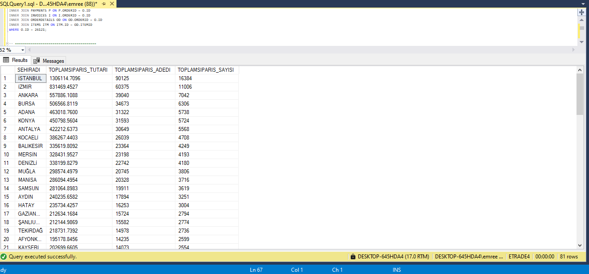
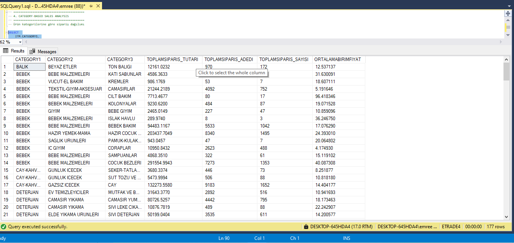
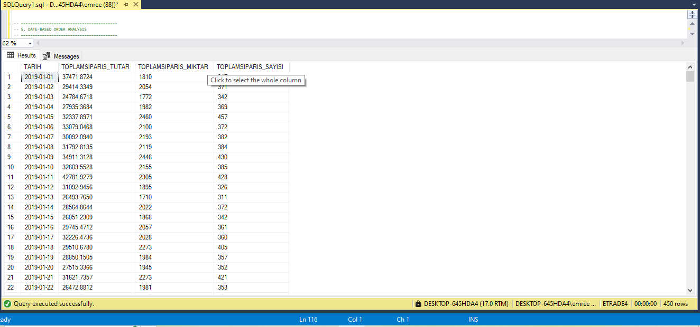
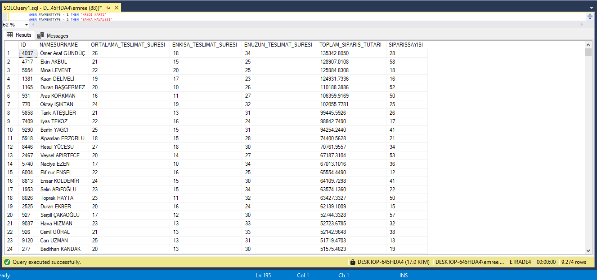
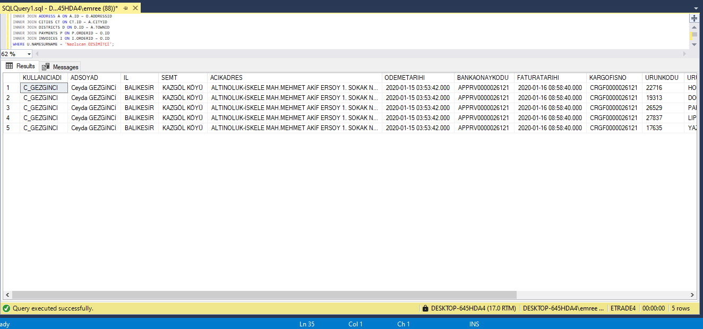

# E-Commerce SQL Sales Analysis

This project contains SQL queries developed to analyze sales, orders, customers, payments, product categories, and delivery performance in an e-commerce database.

## 📌 Project Purpose

The main goal of this project is to practice SQL by solving real-world business problems and performing data analysis on an e-commerce dataset.

This project focuses on transforming raw data into meaningful insights.

---

## 📊 Analysis Topics

The queries in this project cover the following analysis areas:

- Customer transaction details
- Order details with product information
- City-based sales analysis
- Category-based sales analysis
- Daily, monthly, and yearly order trends
- Payment type analysis
- Delivery time performance analysis

---

## 🛠️ SQL Concepts Used

This project demonstrates the use of:

- SELECT
- INNER JOIN
- WHERE
- GROUP BY
- ORDER BY
- HAVING
- SUM()
- COUNT()
- AVG()
- MIN()
- MAX()
- DATEDIFF()
- DATEPART()
- CONVERT()
- CASE WHEN

---

## 📂 Project Structure

---

## 📸 Sample Query Results

### 🏙️ City-Based Analysis

### 🛍️ Category-Based Analysis

### 📅 Date-Based Analysis

### 🚚 Delivery Time Analysis

### 📦 Order Details

---

## 📈 Key Insights

- Sales distribution varies significantly across cities
- Product categories show different purchasing patterns
- Order volume changes over time (daily/monthly trends)
- Delivery time performance differs between customers
- Detailed order-level data helps understand purchasing behavior

---

## 🎯 Skills Demonstrated

- Writing complex multi-table SQL joins
- Performing data aggregation and analysis
- Using date and time functions for reporting
- Creating business-oriented queries
- Analyzing customer and sales behavior

---

## 🧠 About This Project

This project was created as part of my learning journey in SQL and data analysis.  
It reflects my ability to work with relational databases and extract meaningful insights from data.

---

## 👤 Author

**Emre Erol**
